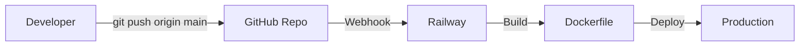
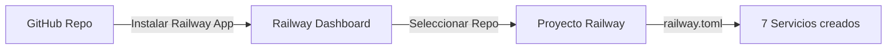

# 🚂 Guía de Despliegue en Railway (GitHub Integration) — Clínica X

> **Última actualización:** 2026-05-22  
> **Proyecto:** Clínica X — Microservicios con Supabase  
> **Infraestructura:** Railway + Supabase (PostgreSQL + Storage + Edge Functions)  
> **Método de despliegue:** GitHub Integration (Automático con CI/CD)  

---

## 📋 Tabla de Contenidos

1. [Arquitectura de Despliegue](#arquitectura-de-despliegue)
2. [Flujo de Trabajo GitHub → Railway](#flujo-de-trabajo-github--railway)
3. [Requisitos Previos](#requisitos-previos)
4. [Configuración Inicial en Railway](#configuración-inicial-en-railway)
5. [Variables de Entorno](#variables-de-entorno)
6. [Despliegue Paso a Paso](#despliegue-paso-a-paso)
7. [Ejecución de Migraciones](#ejecución-de-migraciones)
8. [Verificación del Despliegue](#verificación-del-despliegue)
9. [Solución de Problemas](#solución-de-problemas)
10. [Consideraciones de Seguridad](#consideraciones-de-seguridad)
11. [GitHub Actions (Opcional)](#github-actions-opcional)

---

## 🏗️ Arquitectura de Despliegue

```
┌─────────────────────────────────────────────────────────────────────────────┐
│                              RAILWAY (Cloud)                                │
│                                                                             │
│  ┌─────────────────────────────────────────────────────────────────────┐   │
│  │                        API Gateway (8080)                           │   │
│  │  ┌─────────────┐  ┌─────────────┐  ┌─────────────┐  ┌──────────┐  │   │
│  │  │  /api/auth  │  │ /api/admin  │  │/api/medical │  │/api/files│  │   │
│  │  └──────┬──────┘  └──────┬──────┘  └──────┬──────┘  └────┬─────┘  │   │
│  └─────────┼────────────────┼────────────────┼──────────────┼────────┘   │
│            │                │                │              │            │
│  ┌─────────▼────────┐ ┌─────▼────────┐ ┌─────▼────────┐ ┌───▼────────┐ │
│  │ auth-service     │ │ appointment │ │ clinical-    │ │ file-      │ │
│  │ (3000)           │ │ -service    │ │ service      │ │ service    │ │
│  │                  │ │ (3001)      │ │ (3002)       │ │ (3003)     │ │
│  └────────┬─────────┘ └─────────────┘ └──────┬───────┘ └────────────┘ │
│           │                                    │                        │
│  ┌────────▼────────────────────────────────────▼────────────────────┐ │
│  │                     ocr-service (3004)                            │ │
│  └───────────────────────────────────────────────────────────────────┘ │
│                                                                             │
│  ┌─────────────────────────────────────────────────────────────────────┐   │
│  │                    Frontend Next.js (3100)                          │   │
│  │         (Expuesto públicamente con dominio de Railway)             │   │
│  └─────────────────────────────────────────────────────────────────────┘   │
│                                                                             │
└─────────────────────────────────────────────────────────────────────────────┘
                                    │
                                    ▼
┌─────────────────────────────────────────────────────────────────────────────┐
│                              SUPABASE (Cloud)                               │
│                                                                             │
│  ┌─────────────────┐  ┌─────────────────┐  ┌─────────────────────────────┐   │
│  │   PostgreSQL    │  │     Storage     │  │    Edge Functions         │   │
│  │                 │  │                 │  │    (send-reset-email)     │   │
│  │  4 schemas:     │  │                 │  │                             │   │
│  │  • auth_service │  │  clinica-x-     │  │                             │   │
│  │  • appointment  │  │  archivos       │  │                             │   │
│  │  • clinical     │  │                 │  │                             │   │
│  │  • file_service │  │                 │  │                             │   │
│  └─────────────────┘  └─────────────────┘  └─────────────────────────────┘   │
│                                                                             │
└─────────────────────────────────────────────────────────────────────────────┘
```

### Servicios en Railway

| Servicio | Puerto Interno | Dockerfile | Schema DB | Descripción |
|----------|----------------|------------|-----------|-------------|
| `api-gateway` | 8080 | ✅ | — | Proxy inverso + JWT + CORS |
| `auth-service` | 3000 | ✅ | `auth_service` | Autenticación y usuarios |
| `appointment-service` | 3001 | ✅ | `appointment_service` | Citas, médicos, especialidades |
| `clinical-service` | 3002 | ✅ | `clinical_service` | Consultas, diagnósticos, recetas |
| `file-service` | 3003 | ✅ | `file_service` | Archivos a Supabase Storage |
| `ocr-service` | 3004 | ✅ | `clinical_service` | OCR de análisis clínicos |
| `frontend` | 3100 | ✅ | — | Next.js 14 (App Router) |

---

## 🔄 Flujo de Trabajo GitHub → Railway

Este proyecto usa **GitHub Integration** de Railway, lo que significa:



**Ventajas de este enfoque:**
- ✅ **Despliegue automático:** Cada `push` a `main` redeploya automáticamente
- ✅ **Sin CLI local:** No necesitas instalar Railway CLI en tu máquina
- ✅ **CI/CD nativo:** Integración directa con tu flujo de trabajo Git
- ✅ **Rollback fácil:** Revertir un commit en Git = revertir el despliegue
- ✅ **Colaboración:** Todo el equipo ve los despliegues en el mismo lugar

**Archivos que Railway detecta automáticamente:**
- `railway.toml` (configuración del monorepo)
- `services/*/Dockerfile` (cada microservicio)
- `frontend/Dockerfile` (frontend Next.js)
- `services/*/railway.json` (configuración por servicio)

---

## 📦 Requisitos Previos

### 1. Repositorio en GitHub

- El proyecto debe estar en un repositorio de GitHub (público o privado)
- Tener permisos de administrador para instalar la Railway GitHub App

### 2. Cuenta en Railway

- Crear cuenta gratuita en [railway.app](https://railway.app)
- No necesitas instalar Railway CLI (todo se hace vía web + GitHub)

### 3. Proyecto en Supabase

- Tener acceso al proyecto Supabase `jwcfqgvfvkszsqeejewz`
- Conocer las credenciales de conexión (host, usuario, contraseña)

---

## ⚙️ Configuración Inicial en Railway

### Paso 1: Crear Proyecto en Railway

1. Ve a [railway.app](https://railway.app) e inicia sesión
2. Haz clic en "New Project"
3. Selecciona "Deploy from GitHub repo"
4. Busca y selecciona tu repositorio `clinica-x`
5. Railway detectará automáticamente el archivo `railway.toml` y creará los 7 servicios

> 💡 **Nota:** Si Railway NO detecta automáticamente los servicios, puedes crearlos manualmente:
> 1. Crea un proyecto vacío
> 2. Ve a "Create Service" → "GitHub Repo"
> 3. Para cada servicio, selecciona el repo y configura el **Root Directory**

### Paso 2: Verificar Detección Automática de Servicios

Railway debería detectar automáticamente estos servicios desde `railway.toml`:

| Servicio Detectado | Root Directory | Dockerfile |
|-------------------|----------------|------------|
| `auth-service` | `services/auth-service` | ✅ |
| `appointment-service` | `services/appointment-service` | ✅ |
| `clinical-service` | `services/clinical-service` | ✅ |
| `file-service` | `services/file-service` | ✅ |
| `ocr-service` | `services/ocr-service` | ✅ |
| `api-gateway` | `services/api-gateway` | ✅ |
| `frontend` | `frontend` | ✅ |

**Si un servicio no se detecta automáticamente:**
1. Ve al dashboard del proyecto
2. "New" → "GitHub Repo"
3. Selecciona tu repositorio
4. En "Root Directory", escribe la ruta (ej: `services/auth-service`)
5. Railway detectará el Dockerfile automáticamente

### Paso 3: Configurar Variables de Entorno

Railway permite configurar variables a nivel de proyecto (compartidas) o por servicio.

**Variables compartidas (Shared Variables):**
```
JWT_SECRET=<secreto-jwt-32-caracteres>
SUPABASE_URL=https://jwcfqgvfvkszsqeejewz.supabase.co
SUPABASE_SERVICE_ROLE_KEY=<tu-service-role-key>
```

**Variables por servicio:**

| Servicio | Variable | Valor |
|----------|----------|-------|
| `auth-service` | `DATABASE_URL` | `postgresql://.../postgres?schema=auth_service...` |
| `auth-service` | `DIRECT_URL` | `postgresql://.../postgres?schema=auth_service...` |
| `auth-service` | `PORT` | `3000` |
| `appointment-service` | `DATABASE_URL` | `postgresql://.../postgres?schema=appointment_service...` |
| `appointment-service` | `DIRECT_URL` | `postgresql://.../postgres?schema=appointment_service...` |
| `appointment-service` | `PORT` | `3001` |
| `appointment-service` | `AUTH_SERVICE_URL` | `http://auth-service.railway.internal:3000` |
| `clinical-service` | `DATABASE_URL` | `postgresql://.../postgres?schema=clinical_service...` |
| `clinical-service` | `DIRECT_URL` | `postgresql://.../postgres?schema=clinical_service...` |
| `clinical-service` | `PORT` | `3002` |
| `clinical-service` | `AUTH_SERVICE_URL` | `http://auth-service.railway.internal:3000` |
| `clinical-service` | `APPOINTMENT_SERVICE_URL` | `http://appointment-service.railway.internal:3001` |
| `clinical-service` | `FILE_SERVICE_URL` | `http://file-service.railway.internal:3003` |
| `file-service` | `DATABASE_URL` | `postgresql://.../postgres?schema=file_service...` |
| `file-service` | `DIRECT_URL` | `postgresql://.../postgres?schema=file_service...` |
| `file-service` | `PORT` | `3003` |
| `ocr-service` | `DATABASE_URL` | `postgresql://.../postgres?schema=clinical_service...` |
| `ocr-service` | `DIRECT_URL` | `postgresql://.../postgres?schema=clinical_service...` |
| `ocr-service` | `PORT` | `3004` |
| `ocr-service` | `FILE_SERVICE_URL` | `http://file-service.railway.internal:3003` |
| `ocr-service` | `AUTH_SERVICE_URL` | `http://auth-service.railway.internal:3000` |
| `api-gateway` | `PORT` | `8080` |
| `api-gateway` | `AUTH_SERVICE_URL` | `http://auth-service.railway.internal:3000` |
| `api-gateway` | `APPOINTMENT_SERVICE_URL` | `http://appointment-service.railway.internal:3001` |
| `api-gateway` | `CLINICAL_SERVICE_URL` | `http://clinical-service.railway.internal:3002` |
| `api-gateway` | `FILE_SERVICE_URL` | `http://file-service.railway.internal:3003` |
| `api-gateway` | `OCR_SERVICE_URL` | `http://ocr-service.railway.internal:3004` |
| `api-gateway` | `CORS_ORIGIN` | `https://frontend-tu-dominio.up.railway.app` |
| `frontend` | `NEXT_PUBLIC_API_BASE_URL` | `https://api-gateway-tu-dominio.up.railway.app` |
| `frontend` | `PORT` | `3100` |

> 💡 **Tip:** Usa el archivo `.env.railway` en la raíz como plantilla para copiar las variables.

---

## 🚀 Despliegue Paso a Paso (GitHub Integration)

### Paso 1: Conectar GitHub a Railway



1. En Railway dashboard, ve a tu proyecto
2. Ve a **Settings** → **Source**
3. Haz clic en "Connect GitHub Repo"
4. Selecciona tu organización/usuario y el repositorio `clinica-x`
5. Autoriza la Railway GitHub App

### Paso 2: Configurar Rama de Despliegue

1. En cada servicio, ve a **Settings** → **Source**
2. Asegúrate de que la rama sea `main` (o la rama que uses)
3. Selecciona "Auto-deploy" para que se despliegue automáticamente con cada push

### Paso 3: Primer Despliegue Manual (Opcional)

Si no quieres esperar al próximo push, puedes forzar el primer despliegue:

1. En cada servicio, haz clic en el botón **Deploy**
2. Railway clonará el repo y ejecutará el build usando el Dockerfile
3. Espera a que el build termine (puede tardar 5-10 minutos la primera vez)

### Flujo de Trabajo Diario

Después de la configuración inicial, el flujo de trabajo es:

```bash
# 1. Haces cambios en el código
git add .
git commit -m "feat: nuevo endpoint para citas"

# 2. Push a main
git push origin main

# 3. Railway detecta automáticamente y redeploya
# (Verás el progreso en el dashboard de Railway)
```

### Despliegue de Servicios Específicos

Por defecto, Railway redeploya **todos los servicios** con cada push. Para optimizar:

**Opción A:** Usa el workflow de GitHub Actions (`.github/workflows/railway-deploy.yml`)
- Detecta qué archivos cambiaron
- Solo redeploya los servicios afectados
- Requiere configurar `RAILWAY_TOKEN` en GitHub Secrets

**Opción B:** Configura "Deploy on Push" por servicio
- En Railway dashboard, puedes pausar el auto-deploy de servicios individuales
- Útil si solo quieres redeployar el frontend sin tocar el backend

### Orden Recomendado de Primer Despliegue

```
1. auth-service      (sin dependencias)
2. appointment-service (depende de auth-service)
3. file-service      (sin dependencias)
4. clinical-service  (depende de auth, appointment, file)
5. ocr-service       (depende de file, auth)
6. api-gateway       (depende de todos)
7. frontend          (depende de api-gateway)
```

---

## 🗄️ Ejecución de Migraciones

Las migraciones deben ejecutarse **después** del primer despliegue. Como estamos usando GitHub Integration, hay dos formas:

### Opción A: Railway CLI (Recomendado para migraciones)

Instala Railway CLI solo para ejecutar comandos (no para desplegar):

```bash
# Instalar CLI
npm install -g @railway/cli

# Login (una sola vez)
railway login

# Vincular al proyecto (selecciona tu proyecto)
railway link

# Ejecutar migraciones en cada servicio
railway run --service auth-service pnpm prisma migrate deploy
railway run --service appointment-service pnpm prisma migrate deploy
railway run --service clinical-service pnpm prisma migrate deploy
railway run --service file-service pnpm prisma migrate deploy

# OCR solo genera cliente (no migra)
railway run --service ocr-service pnpm prisma generate
```

### Opción B: Dashboard de Railway (Sin CLI)

1. Ve al dashboard de Railway
2. Selecciona el servicio (ej: `auth-service`)
3. Ve a la pestaña "Shell" (terminal en el contenedor)
4. Ejecuta: `pnpm prisma migrate deploy`

### Opción C: GitHub Actions (Automático)

Puedes agregar un workflow que ejecute migraciones automáticamente después del despliegue. Ejemplo en `.github/workflows/migrate.yml`:

```yaml
name: 🗄️ Run Prisma Migrations
on:
  push:
    branches: [main]
    paths:
      - 'services/**/prisma/migrations/**'

jobs:
  migrate:
    runs-on: ubuntu-latest
    steps:
      - uses: actions/checkout@v4
      - uses: railway/setup-railway@v1
        with:
          railway-token: ${{ secrets.RAILWAY_TOKEN }}
      - run: railway run --service auth-service pnpm prisma migrate deploy
      - run: railway run --service appointment-service pnpm prisma migrate deploy
      - run: railway run --service clinical-service pnpm prisma migrate deploy
      - run: railway run --service file-service pnpm prisma migrate deploy
```

### Seeds (Opcional)

```bash
# Crear usuario ADMIN
railway run --service auth-service pnpm ts-node prisma/seed.ts

# Seeds de appointment-service
railway run --service appointment-service pnpm ts-node prisma/seed.ts
```

---

## ✅ Verificación del Despliegue

### 1. Healthchecks

Cada servicio expone un endpoint `/health`. Verifica que respondan:

```bash
# Obtener la URL pública de Railway para cada servicio
# (Están en el dashboard de Railway)

curl https://api-gateway-tu-proyecto.up.railway.app/health
curl https://auth-service-tu-proyecto.up.railway.app/health
# ... etc
```

### 2. Flujo de Prueba End-to-End

1. **Registro de paciente:**
   ```bash
   curl -X POST https://api-gateway-tu-proyecto.up.railway.app/api/auth/register \
     -H "Content-Type: application/json" \
     -d '{"dni":"12345678","email":"test@test.com","password":"Test123!","nombre":"Juan","apellido":"Pérez","telefono":"999888777"}'
   ```

2. **Login:**
   ```bash
   curl -X POST https://api-gateway-tu-proyecto.up.railway.app/api/auth/login \
     -H "Content-Type: application/json" \
     -d '{"email":"test@test.com","password":"Test123!"}'
   ```

3. **Crear especialidad:**
   ```bash
   curl -X POST https://api-gateway-tu-proyecto.up.railway.app/api/admin/especialidades \
     -H "Content-Type: application/json" \
     -H "Authorization: Bearer <token-admin>" \
     -d '{"nombre":"Cardiología"}'
   ```

4. **Verificar frontend:**
   Abre `https://frontend-tu-proyecto.up.railway.app` en el navegador.

---

## 🔧 Solución de Problemas

### Problema 1: Build falla por falta de memoria

**Sintoma:** El build en Railway se interrumpe con errores de memoria.

**Solución:**
- En Railway dashboard, ve a Settings → Resource Limits
- Aumenta el límite de memoria para el servicio (mínimo 2GB recomendado para builds de TypeScript)
- Alternativamente, optimiza el Dockerfile reduciendo las capas:
  ```dockerfile
# Usar --mount=cache para cachear node_modules entre builds (BuildKit)
RUN --mount=type=cache,id=pnpm,target=/pnpm/store pnpm install --frozen-lockfile
```

### Problema 2: Servicios no se comunican entre sí

**Sintoma:** `api-gateway` retorna 502 o timeout al llamar a otros servicios.

**Verificación:**
```bash
# Desde un servicio, verificar que puede resolver el nombre del otro
railway run --service api-gateway sh -c "wget -qO- http://auth-service.railway.internal:3000/health"
```

**Causas comunes:**
- Variables `*_SERVICE_URL` incorrectas (deben usar `.railway.internal`)
- El servicio destino no está corriendo
- Firewall/Rules de Railway bloqueando tráfico interno

### Problema 3: Prisma Migrate falla en Railway

**Sintoma:** Error de conexión a PostgreSQL o permisos insuficientes.

**Verificación:**
```bash
# Verificar que la URL de conexión es correcta
railway run --service auth-service sh -c "echo $DATABASE_URL"

# Probar conexión directa
railway run --service auth-service sh -c "npx prisma db pull"
```

**Solución:**
- Asegúrate de usar `DIRECT_URL` (puerto 5432) para migraciones, no `DATABASE_URL` (puerto 6543/pooler)
- Verifica que el usuario de Supabase tenga permisos de CREATE/ALTER

### Problema 4: Frontend no carga o errores de CORS

**Verificación:**
- Revisa que `NEXT_PUBLIC_API_BASE_URL` apunte al dominio público del API Gateway
- Revisa que `CORS_ORIGIN` en el API Gateway incluya el dominio del frontend
- Asegúrate de que el API Gateway esté desplegado y funcionando antes que el frontend

### Problema 5: OCR no procesa archivos

**Verificación:**
- Confirma que `OCR_SPACE_API_KEY` está configurada y es válida
- Verifica que `SUPABASE_BUCKET` y `SUPABASE_SERVICE_ROLE_KEY` son correctos
- Revisa los logs del `ocr-service` en Railway dashboard

---

## 🔒 Consideraciones de Seguridad

### 1. Variables de Entorno Sensibles

- ✅ **NUNCA** subas archivos `.env` con credenciales reales al repositorio
- ✅ Usa el archivo `.env.railway` como **plantilla** (ya está en `.gitignore` implícitamente)
- ✅ En Railway, configura las variables sensibles como "Secrets" (se enmascaran en el dashboard)

### 2. Variables que DEBEN ser Secrets

```
JWT_SECRET
SUPABASE_SERVICE_ROLE_KEY
DATABASE_URL (contiene contraseña)
DIRECT_URL (contiene contraseña)
OPENAI_API_KEY
OCR_SPACE_API_KEY
INTERNAL_EMAIL_SECRET
```

### 3. HTTPS en Producción

- Railway proporciona HTTPS automáticamente para todos los servicios
- El frontend debe usar `https://` para llamar al API Gateway
- Asegúrate de que `NEXT_PUBLIC_API_BASE_URL` use `https://`

### 4. Dominios Personalizados

- En Railway dashboard, ve a Settings → Domains
- Configura un dominio personalizado para el API Gateway (ej: `api.clinicax.com`)
- Configura un dominio personalizado para el Frontend (ej: `app.clinicax.com`)
- Actualiza `CORS_ORIGIN` y `NEXT_PUBLIC_API_BASE_URL` con los dominios reales

### 5. INTERNAL_API_KEY

Los servicios se comunican entre sí usando un header `INTERNAL_API_KEY`. Asegúrate de que:
- Todos los servicios compartan el mismo valor
- El header se valida en cada servicio destino
- El valor sea seguro y aleatorio (generado con `openssl rand -base64 32`)

---

## 📊 Monitoreo y Logs

### Ver Logs en Railway Dashboard

1. Ve al dashboard de Railway
2. Selecciona el servicio
3. Ve a la pestaña "Logs"
4. Filtra por nivel (INFO, WARN, ERROR)

### Logs desde CLI

```bash
# Ver logs de un servicio
railway logs --service auth-service

# Ver logs en tiempo real
railway logs --service auth-service --follow
```

### Métricas

Railway proporciona métricas básicas:
- CPU usage
- Memory usage
- Network I/O
- Disk usage

Ve a Settings → Metrics en el dashboard de cada servicio.

---

## 🔄 Actualización del Despliegue

Para actualizar un servicio después de hacer cambios en el código:

```bash
# Commit y push
git add .
git commit -m "fix: corrección en auth-service"
git push origin main

# Railway detecta automáticamente el push y redeploya
# (si tienes GitHub Integration habilitada)
```

O manualmente:

```bash
# Redeploy específico
railway up --service auth-service --directory services/auth-service
```

---

## 🤖 GitHub Actions (Opcional)

Si quieres más control sobre el despliegue (ej: solo desplegar servicios que cambiaron), puedes usar el workflow de GitHub Actions incluido.

### Configuración

1. Ve a GitHub → Settings → Secrets → Actions
2. Añade el secret `RAILWAY_TOKEN`:
   - Genera el token: `railway login` → `railway profile` → "Create Token"
   - Copia el token y pégalo en el secret de GitHub
3. El workflow `.github/workflows/railway-deploy.yml` se ejecutará automáticamente

### Ventajas del Workflow

- ✅ **Despliegue selectivo:** Solo redeploya los servicios que cambiaron
- ✅ **Parallel deploy:** Despliega múltiples servicios en paralelo
- ✅ **Notificaciones:** Recibe notificaciones de éxito/fallo
- ✅ **Control total:** Puedes personalizar el flujo (tests, lint, etc.)

### Diferencia entre GitHub Integration y GitHub Actions

| Característica | GitHub Integration (Nativo) | GitHub Actions (Workflow) |
|---------------|---------------------------|--------------------------|
| Configuración | Automática (`railway.toml`) | Manual (`.github/workflows/*.yml`) |
| Despliegue | Todos los servicios | Selectivo (por cambios) |
| Velocidad | Inmediato (webhook) | ~1-2 minutos (runner) |
| Control | Limitado | Total (pasos personalizables) |
| Recomendado | ✅ Para empezar | Para monorepos maduros |

---

## 📁 Archivos Relacionados

| Archivo | Descripción |
|---------|-------------|
| `.env.railway` | Plantilla de variables de entorno para Railway |
| `railway.toml` | **Configuración del monorepo** (detectada automáticamente por Railway) |
| `railway.yaml` | Configuración general del proyecto (fallback) |
| `services/*/railway.json` | Configuración específica de cada servicio |
| `services/*/Dockerfile` | Dockerfile multi-stage para cada servicio |
| `frontend/Dockerfile` | Dockerfile del frontend Next.js |
| `scripts/deploy-railway.sh` | Script de despliegue manual (alternativa a GitHub) |
| `.github/workflows/railway-deploy.yml` | Workflow de GitHub Actions (opcional) |

---

## 🆘 Soporte

- **Railway Docs:** [docs.railway.app](https://docs.railway.app)
- **Railway CLI:** `railway --help`
- **Status:** [status.railway.app](https://status.railway.app)
- **Discord:** [discord.gg/railway](https://discord.gg/railway)

---

## ✅ Checklist Pre-Despliegue (GitHub Integration)

- [ ] Repositorio en GitHub (público o privado)
- [ ] Cuenta en Railway creada
- [ ] Proyecto en Railway vinculado al repositorio de GitHub
- [ ] Railway GitHub App instalada en el repositorio
- [ ] 7 servicios detectados automáticamente (o creados manualmente)
- [ ] Root directory configurado para cada servicio (si fue manual)
- [ ] Variables de entorno configuradas (compartidas + por servicio)
- [ ] Secrets configurados (`JWT_SECRET`, `DATABASE_URL`, etc.)
- [ ] Dockerfile presente en cada servicio
- [ ] `railway.toml` presente en la raíz (para detección automática)
- [ ] `railway.json` presente en cada servicio (configuración adicional)
- [ ] Supabase accesible desde IPs de Railway (verificar firewall)
- [ ] Dominio personalizado configurado (opcional)
- [ ] GitHub Actions workflow configurado (opcional, requiere `RAILWAY_TOKEN`)

---

**¡Listo para desplegar! 🚀**

> 💡 **Recordatorio:** Con GitHub Integration, cada `git push origin main` desencadena automáticamente un nuevo despliegue. No necesitas hacer nada manualmente en Railway.
