# Diagrama Físico de Base de Datos — Clínica X

> **Fecha:** 2026-05-22  
> **Proyecto:** Clínica X — Arquitectura de Microservicios con Supabase  
> **Base de datos:** PostgreSQL 15+ (Supabase)  
> **Schemas:** 4 separados por microservicio (`auth_service`, `appointment_service`, `clinical_service`, `file_service`)  
> **Nota especial:** El microservicio `ocr-service` comparte el schema `clinical_service` con `clinical-service`

---

## Arquitectura de Microservicios y Schemas

| Microservicio | Schema PostgreSQL | Tablas Propias | Tablas Compartidas |
|---------------|-------------------|----------------|-------------------|
| **auth-service** | `auth_service` | `usuarios` | — |
| **appointment-service** | `appointment_service` | `especialidades`, `medicos`, `horarios_medico`, `citas` | — |
| **clinical-service** | `clinical_service` | `consultas`, `ordenes_analisis`, `catalogo_medicamentos`, `medicamentos` | `analisis_resultados`, `analisis_grupos`, `analisis_items` |
| **ocr-service** | `clinical_service` | — | `ordenes_analisis`¹, `analisis_resultados`, `analisis_grupos`, `analisis_items` |
| **file-service** | `file_service` | `archivos` | — |

> ¹ El `ocr-service` tiene acceso de lectura a `ordenes_analisis` pero no la crea directamente; las órdenes las genera `clinical-service`.

---

## Leyenda del Diagrama

| Símbolo | Significado |
|---------|-------------|
| 🔑 | Clave primaria (Primary Key) |
| 🔗 | Clave foránea (Foreign Key) |
| ➡️ | Relación entre entidades |
| `NOT NULL` | Campo obligatorio |
| `UNIQUE` | Campo único |
| `FK` | Foreign Key (real, cross-schema permitido) |

---

## Diagrama Entidad-Relación Físico

```mermaid
%%{init: {'theme': 'base', 'themeVariables': { 'primaryColor': '#e1f5fe', 'primaryBorderColor': '#01579b', 'primaryTextColor': '#000000', 'lineColor': '#0277bd', 'secondaryColor': '#e8f5e9', 'tertiaryColor': '#fff3e0' }}}%%
erDiagram
    %% =============================================================================
    %% SCHEMA: auth_service
    %% =============================================================================
    USUARIOS {
        uuid id PK "gen_random_uuid()"
        varchar dni UK "NOT NULL"
        varchar email UK "NOT NULL"
        varchar password_hash "NOT NULL"
        varchar nombre "NOT NULL"
        varchar apellido "NOT NULL"
        varchar telefono "NULL"
        enum rol "PACIENTE | MEDICO | ADMIN"
        varchar reset_token "NULL"
        timestamptz reset_token_expira "NULL"
        timestamptz creado_en "DEFAULT now()"
        timestamptz actualizado_en "DEFAULT now()"
    }

    %% =============================================================================
    %% SCHEMA: appointment_service
    %% =============================================================================
    ESPECIALIDADES {
        uuid id PK "gen_random_uuid()"
        varchar nombre UK "NOT NULL"
        boolean activo "DEFAULT true"
        timestamptz creado_en "DEFAULT now()"
        timestamptz actualizado_en "DEFAULT now()"
    }

    MEDICOS {
        uuid id PK "gen_random_uuid()"
        uuid usuario_id FK "→ auth_service.usuarios.id (UNIQUE)"
        varchar nombre_usuario UK "NOT NULL"
        uuid especialidad_id FK "→ especialidades.id"
        enum turno "MANANA | TARDE"
        boolean activo "DEFAULT true"
        timestamptz creado_en "DEFAULT now()"
        timestamptz actualizado_en "DEFAULT now()"
    }

    HORARIOS_MEDICO {
        uuid id PK "gen_random_uuid()"
        uuid medico_id FK "→ medicos.id"
        integer dia_semana "1-7 (NOT NULL)"
        time hora_inicio "NOT NULL"
        time hora_fin "NOT NULL"
        integer duracion_slot "DEFAULT 30"
        timestamptz creado_en "DEFAULT now()"
    }

    CITAS {
        uuid id PK "gen_random_uuid()"
        uuid paciente_id FK "→ auth_service.usuarios.id"
        uuid medico_id FK "→ medicos.id"
        timestamptz fecha_hora "NOT NULL"
        enum estado "CONFIRMADA | EN_ATENCION | COMPLETADA | CANCELADA"
        enum tipo_reserva "MANUAL | AUTOMATICA"
        text motivo "NULL"
        timestamptz creado_en "DEFAULT now()"
        timestamptz actualizado_en "DEFAULT now()"
    }

    %% =============================================================================
    %% SCHEMA: file_service
    %% =============================================================================
    ARCHIVOS {
        uuid id PK "gen_random_uuid()"
        varchar propietario_servicio "NOT NULL"
        uuid propietario_recurso_id "NOT NULL"
        varchar bucket "NOT NULL"
        varchar key_s3 UK "NOT NULL"
        varchar nombre_original "NOT NULL"
        varchar mime_type "NOT NULL"
        integer tamano_bytes "NOT NULL"
        timestamptz subido_en "DEFAULT now()"
    }

    %% =============================================================================
    %% SCHEMA: clinical_service
    %% =============================================================================
    CATALOGO_MEDICAMENTOS {
        uuid id PK "gen_random_uuid()"
        varchar nombre UK "NOT NULL"
        boolean activo "DEFAULT true"
        timestamptz creado_en "DEFAULT now()"
    }

    CONSULTAS {
        uuid id PK "gen_random_uuid()"
        uuid paciente_id FK "→ auth_service.usuarios.id"
        uuid medico_id FK "→ appointment_service.medicos.id"
        uuid cita_id FK "→ appointment_service.citas.id (NULLABLE)"
        enum estado "ACTIVA | FINALIZADA"
        text motivo_consulta "NULL"
        text diagnostico "NULL"
        text notas "NULL"
        timestamptz fecha_inicio "DEFAULT now()"
        timestamptz fecha_fin "NULL"
        timestamptz creado_en "DEFAULT now()"
        timestamptz actualizado_en "DEFAULT now()"
    }

    ORDENES_ANALISIS {
        uuid id PK "gen_random_uuid()"
        uuid consulta_id FK "→ consultas.id"
        varchar tipo_analisis "NOT NULL"
        varchar especialidad "NULL"
        text descripcion "NULL"
        enum estado "PENDIENTE | COMPLETADA"
        text resultado "NULL"
        uuid archivo_id FK "→ file_service.archivos.id (NULLABLE)"
        uuid analisis_resultado_id UK "NULL"
        timestamptz creado_en "DEFAULT now()"
        timestamptz actualizado_en "DEFAULT now()"
    }

    ANALISIS_RESULTADOS {
        uuid id PK "gen_random_uuid()"
        uuid orden_analisis_id FK "→ ordenes_analisis.id (UNIQUE, NULLABLE)"
        uuid paciente_id FK "→ auth_service.usuarios.id"
        uuid archivo_id FK "→ file_service.archivos.id (UNIQUE)"
        uuid consulta_id "FK lógica → consultas.id (NULLABLE)"
        enum tipo_analisis "SANGRE | ORINA | HECES"
        varchar resultado_id_original "NULL"
        varchar laboratorio "NULL"
        varchar medico_solicitante "NULL"
        date fecha_toma "NULL"
        time hora_toma "NULL"
        date fecha_resultado "NULL"
        jsonb datos_muestra "NULL"
        varchar paciente_nombre_ocr "NULL"
        varchar paciente_id_ocr "NULL"
        date paciente_fecha_nacimiento "NULL"
        varchar paciente_sexo "NULL"
        integer paciente_edad "NULL"
        enum estado_ocr "PROCESANDO | COMPLETADO | ERROR"
        text error_ocr "NULL"
        timestamptz creado_en "DEFAULT now()"
        timestamptz actualizado_en "DEFAULT now()"
    }

    ANALISIS_GRUPOS {
        uuid id PK "gen_random_uuid()"
        uuid analisis_resultado_id FK "→ analisis_resultados.id"
        varchar nombre_grupo "NOT NULL"
        integer orden "DEFAULT 0"
        timestamptz creado_en "DEFAULT now()"
    }

    ANALISIS_ITEMS {
        uuid id PK "gen_random_uuid()"
        uuid grupo_id FK "→ analisis_grupos.id"
        varchar nombre "NOT NULL"
        varchar valor "NOT NULL"
        varchar unidad "NULL"
        varchar rango_min "NULL"
        varchar rango_max "NULL"
        varchar rango_referencia "NULL"
        varchar estado "NULL"
        text nota "NULL"
        integer orden "DEFAULT 0"
        timestamptz creado_en "DEFAULT now()"
    }

    MEDICAMENTOS {
        uuid id PK "gen_random_uuid()"
        uuid consulta_id FK "→ consultas.id"
        varchar nombre "NOT NULL"
        integer dias "NOT NULL DEFAULT 0"
        varchar frecuencia "NOT NULL"
        timestamptz creado_en "DEFAULT now()"
        timestamptz actualizado_en "DEFAULT now()"
    }

    %% =============================================================================
    %% RELACIONES (Foreign Keys)
    %% =============================================================================

    %% auth_service <-> appointment_service
    USUARIOS ||--o| MEDICOS : "1:1 (usuario_id)"
    USUARIOS ||--o{ CITAS : "1:N (paciente_id)"

    %% appointment_service interno
    ESPECIALIDADES ||--o{ MEDICOS : "1:N (especialidad_id)"
    MEDICOS ||--o{ HORARIOS_MEDICO : "1:N (medico_id, CASCADE)"
    MEDICOS ||--o{ CITAS : "1:N (medico_id)"

    %% file_service <-> clinical_service
    ARCHIVOS ||--o| ORDENES_ANALISIS : "1:1 (archivo_id, NULLABLE)"
    ARCHIVOS ||--o| ANALISIS_RESULTADOS : "1:1 (archivo_id)"

    %% clinical_service interno
    CONSULTAS ||--o{ ORDENES_ANALISIS : "1:N (consulta_id, CASCADE)"
    CONSULTAS ||--o{ MEDICAMENTOS : "1:N (consulta_id, CASCADE)"
    ORDENES_ANALISIS ||--o| ANALISIS_RESULTADOS : "1:1 (orden_analisis_id, NULLABLE)"
    ANALISIS_RESULTADOS ||--o{ ANALISIS_GRUPOS : "1:N (analisis_resultado_id, CASCADE)"
    ANALISIS_GRUPOS ||--o{ ANALISIS_ITEMS : "1:N (grupo_id, CASCADE)"

    %% Cross-schema adicionales
    USUARIOS ||--o{ CONSULTAS : "1:N (paciente_id)"
    MEDICOS ||--o{ CONSULTAS : "1:N (medico_id)"
    CITAS ||--o| CONSULTAS : "1:1 (cita_id, NULLABLE)"
    USUARIOS ||--o{ ANALISIS_RESULTADOS : "1:N (paciente_id)"
```



---

## Resumen de Schemas y Tablas

| Schema | Microservicio Principal | Tablas Exclusivas | Tablas Compartidas |
|--------|------------------------|-------------------|-------------------|
| `auth_service` | **auth-service** | `usuarios` | — |
| `appointment_service` | **appointment-service** | `especialidades`, `medicos`, `horarios_medico`, `citas` | — |
| `file_service` | **file-service** | `archivos` | — |
| `clinical_service` | **clinical-service** + **ocr-service** | `consultas`, `catalogo_medicamentos`, `medicamentos` | `ordenes_analisis`, `analisis_resultados`, `analisis_grupos`, `analisis_items` |

---

## Resumen de Foreign Keys Reales

| Nombre de la FK | Tabla Origen | Columna Origen | Tabla Destino | Columna Destino | Tipo |
|-----------------|--------------|----------------|---------------|-------------------|------|
| `fk_medicos_usuario` | `appointment_service.medicos` | `usuario_id` | `auth_service.usuarios` | `id` | **Cross-schema** |
| `fk_medicos_especialidad` | `appointment_service.medicos` | `especialidad_id` | `appointment_service.especialidades` | `id` | Intra-schema |
| `fk_horarios_medico` | `appointment_service.horarios_medico` | `medico_id` | `appointment_service.medicos` | `id` | Intra-schema |
| `fk_citas_paciente` | `appointment_service.citas` | `paciente_id` | `auth_service.usuarios` | `id` | **Cross-schema** |
| `fk_citas_medico` | `appointment_service.citas` | `medico_id` | `appointment_service.medicos` | `id` | Intra-schema |
| `fk_consultas_paciente` | `clinical_service.consultas` | `paciente_id` | `auth_service.usuarios` | `id` | **Cross-schema** |
| `fk_consultas_medico` | `clinical_service.consultas` | `medico_id` | `appointment_service.medicos` | `id` | **Cross-schema** |
| `fk_consultas_cita` | `clinical_service.consultas` | `cita_id` | `appointment_service.citas` | `id` | **Cross-schema** |
| `fk_ordenes_consulta` | `clinical_service.ordenes_analisis` | `consulta_id` | `clinical_service.consultas` | `id` | Intra-schema |
| `fk_ordenes_archivo` | `clinical_service.ordenes_analisis` | `archivo_id` | `file_service.archivos` | `id` | **Cross-schema** |
| `fk_analisis_resultados_orden` | `clinical_service.analisis_resultados` | `orden_analisis_id` | `clinical_service.ordenes_analisis` | `id` | Intra-schema |
| `fk_analisis_resultados_paciente` | `clinical_service.analisis_resultados` | `paciente_id` | `auth_service.usuarios` | `id` | **Cross-schema** |
| `fk_analisis_resultados_archivo` | `clinical_service.analisis_resultados` | `archivo_id` | `file_service.archivos` | `id` | **Cross-schema** |
| `fk_analisis_grupos_resultado` | `clinical_service.analisis_grupos` | `analisis_resultado_id` | `clinical_service.analisis_resultados` | `id` | Intra-schema |
| `fk_analisis_items_grupo` | `clinical_service.analisis_items` | `grupo_id` | `clinical_service.analisis_grupos` | `id` | Intra-schema |
| `fk_medicamentos_consulta` | `clinical_service.medicamentos` | `consulta_id` | `clinical_service.consultas` | `id` | Intra-schema |

---

## Flujo de Datos del OCR-Service

El microservicio `ocr-service` opera sobre el **schema compartido** `clinical_service`. A continuación se describe el flujo de datos:

### Tablas Compartidas entre `clinical-service` y `ocr-service`

```
┌─────────────────────────────────────────────────────────────────┐
│                    clinical_service (schema)                    │
│  ┌─────────────────┐          ┌──────────────────────────┐    │
│  │  clinical-      │          │        ocr-service       │    │
│  │  service        │          │                          │    │
│  │                 │ CREA     │                          │    │
│  │  consultas ─────┼─────────>│  ordenes_analisis        │    │
│  │     │           │          │       │                  │    │
│  │     │           │          │       │ LEE (pendiente)  │    │
│  │     v           │          │       ▼                  │    │
│  │  ordenes_       │          │  analisis_resultados     │    │
│  │  analisis <─────┼──────────┼───────┤                  │    │
│  │  (estado:       │  ACTUALIZA│       │ CREA (grupos)   │    │
│  │   completada)   │  estado  │       ▼                  │    │
│  │                 │          │  analisis_grupos         │    │
│  │  medicamentos   │          │       │                  │    │
│  │  (exclusivo)    │          │       │ CREA (items)      │    │
│  │                 │          │       ▼                  │    │
│  │                 │          │  analisis_items          │    │
│  └─────────────────┘          └──────────────────────────┘    │
└─────────────────────────────────────────────────────────────────┘
```

### Responsabilidades por Servicio

| Tabla | clinical-service | ocr-service |
|-------|-----------------|-------------|
| `ordenes_analisis` | **Crea** las órdenes durante la consulta | **Lee** estado y actualiza referencia a resultados |
| `analisis_resultados` | **Lee** para mostrar en historial | **Crea** después de procesar el PDF con OCR |
| `analisis_grupos` | **Lee** para visualizar resultados | **Crea** con los grupos detectados por OCR |
| `analisis_items` | **Lee** para visualizar resultados | **Crea** con los parámetros individuales |
| `consultas` | **CRUD completo** | No accede |
| `medicamentos` | **CRUD completo** | No accede |
| `catalogo_medicamentos` | **CRUD completo** | No accede |

### Notas Técnicas del OCR-Service

1. **Schema Prisma compartido:** El `ocr-service` tiene su propio `schema.prisma` pero apunta al mismo schema PostgreSQL `clinical_service`. No tiene las FKs cross-schema (a `usuarios`, `archivos`, `consultas`) en su modelo Prisma, pero a nivel de base de datos las restricciones existen y se validan.

2. **Manejo de migraciones:** Las migraciones de las tablas OCR (`analisis_resultados`, `analisis_grupos`, `analisis_items`) son gestionadas por el `clinical-service` como **dueño del schema**. El `ocr-service` debe ejecutar `prisma generate` pero **NO** `prisma migrate`.

3. **Concurrencia:** Ambos servicios pueden leer/escribir simultáneamente gracias a las transacciones ACID de PostgreSQL. El campo `estado_ocr` (`PROCESANDO` → `COMPLETADO`/`ERROR`) actúa como mecanismo de control de estado.

4. **Referencia circular controlada:** La tabla `ordenes_analisis` tiene `analisis_resultado_id` (UNIQUE, NULLABLE) y la tabla `analisis_resultados` tiene `orden_analisis_id` (UNIQUE, NULLABLE). Esto permite la vinculación bidireccional sin crear un ciclo de FKs estricto que impida inserciones.

---

## Notas de Implementación

1. **Cross-schema FKs:** PostgreSQL/Supabase permite Foreign Keys entre schemas sin restricciones, siempre que las tablas referenciadas existan primero.

2. **Orden de creación:** El script `database-schema-completo.sql` crea los schemas y tablas en el orden correcto: primero las tablas sin dependencias (`usuarios`, `especialidades`, `archivos`), luego las que dependen de ellas.

3. **Triggers `updated_at`:** La función `clinical_service.set_updated_at()` y sus triggers mantienen la columna `actualizado_en` sincronizada automáticamente en cada `UPDATE`.

4. **Integridad referencial:** Todas las FKs reales garantizan que:
   - No se puede eliminar un `usuario` si está referenciado por un `medico`, `cita`, `consulta` o `analisis_resultado`.
   - No se puede eliminar un `medico` si tiene `citas`, `horarios` o `consultas`.
   - No se puede eliminar una `cita` si está vinculada a una `consulta`.
   - No se puede eliminar una `consulta` si tiene `ordenes_analisis` o `medicamentos` (salvo que se use `ON DELETE CASCADE`, que está configurado para órdenes y medicamentos).

5. **Índices estratégicos:** Se crearon índices en las columnas más consultadas (`email`, `dni`, `medico_id`, `paciente_id`, `estado`, etc.) para optimizar el rendimiento.

---

## Script SQL Principal

📄 **Ruta:** `scripts/database-schema-completo.sql`  
Este archivo contiene el DDL completo listo para ejecutarse en Supabase PostgreSQL.
